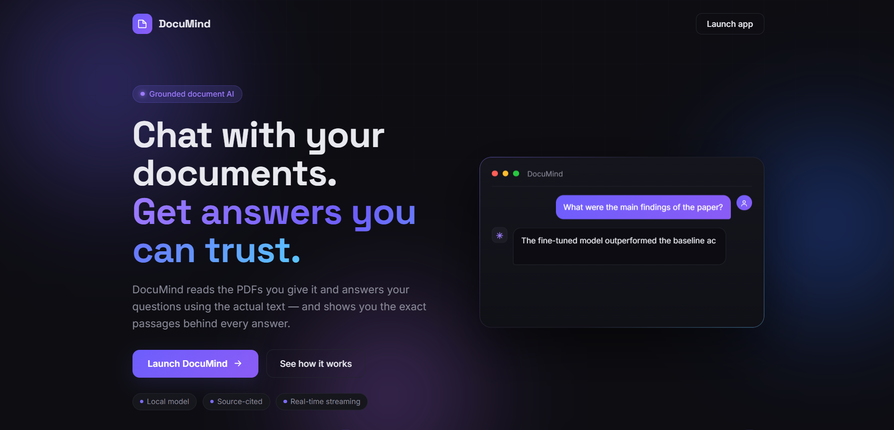
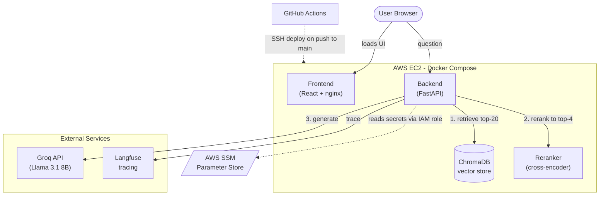

# DocuMind

> Ask questions about your own PDFs and get answers grounded in the source text — with citations, real-time streaming, and full observability. Deployed on AWS with Terraform and a CI/CD pipeline.

<!-- **Live demo:** http://YOUR_SERVER_IP:3000 -->



## What it is

DocuMind is a production-style Retrieval-Augmented Generation (RAG) application. Ask questions about your documents in natural language and get answers synthesized *only* from the relevant passages — with each answer showing the exact source chunks it drew from. It's built end-to-end: a FastAPI backend, a React frontend, provider-switchable LLM inference, and a fully automated AWS deployment.

## Features

- **Grounded answers with citations** — every response is generated from retrieved passages, shown alongside the answer, so nothing is hallucinated out of thin air.
- **Two-stage retrieval** — vector search fetches candidates, then a cross-encoder reranker surfaces only the most relevant chunks.
- **Token-by-token streaming** — answers stream in as they're generated.
- **Provider-switchable LLM** — local Ollama for development, hosted Groq in production, toggled by a single environment variable.
- **Full observability** — every request is traced in Langfuse (retrieval → generation, with token counts and latencies).
- **Automated evaluation** — a RAGAS harness scores faithfulness, answer relevancy, and context precision against a golden question set.
- **Infrastructure as code** — the entire AWS stack is defined in Terraform.
- **CI/CD** — every push to `main` auto-deploys to the server.

## Architecture



**Request flow:** the browser loads the React UI and calls the FastAPI backend's streaming endpoint. The backend embeds the question, retrieves the top candidate chunks from ChromaDB, reranks them with a cross-encoder to keep only the most relevant passages, builds a grounded prompt, and streams the answer from the LLM — sending the source chunks first, then the generated tokens. Every stage is traced to Langfuse. Secrets are pulled at launch from AWS SSM Parameter Store through the instance's IAM role, so nothing sensitive is stored on the server or committed to the repo.

## Tech stack

| Layer | Tools |
|---|---|
| **Backend** | Python, FastAPI, Uvicorn |
| **RAG / ML** | ChromaDB, sentence-transformers, BAAI/bge-reranker-base, Groq, Ollama |
| **Frontend** | React, Vite |
| **Observability & eval** | Langfuse, RAGAS |
| **Infra & DevOps** | AWS (EC2, SSM, IAM, VPC), Terraform, Docker & Docker Compose, GitHub Actions, nginx |

## Design decisions

The interesting engineering here is in the tradeoffs:

- **Hosted inference instead of a GPU.** Self-hosting the LLM on an AWS GPU instance would cost ~$350–400/month. The deployed app instead calls Groq's hosted API (pay-per-token, effectively free at demo volume), while local development still uses Ollama. A single `LLM_PROVIDER` env var switches between them, so one codebase serves both — and the deployed model (Llama 3.1 8B) is actually stronger than the local dev model.
- **Single EC2 + Docker Compose instead of ECS/Fargate.** For a single-instance workload, Fargate's mandatory load balancer alone would roughly triple the cost. A single `t3.small` running the existing Compose stack keeps it at ~$20/month while still demonstrating IaC and CI/CD cleanly.
- **Secrets in SSM, not on the box or in Git.** API keys live in AWS SSM Parameter Store as encrypted parameters. The instance reads them at launch through an IAM role — no credentials on the server, none in the repository. As a bonus, the CI/CD pipeline never has to handle secrets at all.
- **CPU-only in production.** Because the LLM is offloaded to Groq, only the embedding and reranker models run locally, and they run on CPU — which is what makes the cheap instance viable.

## Cost

Running cost is roughly **$20/month**, fully covered by AWS free-tier credits for the first six months:

| Item | Monthly |
|---|---|
| EC2 `t3.small` | ~$15 |
| Public IPv4 (Elastic IP) | ~$3.65 |
| EBS gp3 storage (30 GB) | ~$1.60 |
| Groq API (LLM) | $0 (free tier) |
| SSM, data transfer | $0 |

The GPU alternative would have been ~$350–400/month — the hosted-inference decision is the single biggest cost lever in the project.

## Evaluation

Retrieval and generation quality are measured with a RAGAS harness over a hand-written golden question set, using a fully local judge (no API cost):

| Metric | Score |
|---|---|
| Faithfulness | 0.98 |
| Answer relevancy | 0.93 |
| Context precision | 0.88 |

## Running locally

Requires [Docker](https://www.docker.com/) and [Ollama](https://ollama.com/) (for local LLM inference).

```bash
git clone https://github.com/bedrockexe/documind.git
cd documind

# Configure environment
cp .env.example .env      # then fill in your keys

# Launch the full stack
docker compose up -d --build
```

Then open http://localhost:3000. PDFs placed in the `data/` folder are automatically indexed on startup.

## Deployment

The AWS infrastructure is provisioned with Terraform (in `infra/`): a VPC, public subnet, security group, an EC2 instance, an Elastic IP, and an IAM role granting SSM access. Deployment is automated with GitHub Actions — pushing to `main` connects to the instance over SSH, pulls the latest code, regenerates the environment from SSM, and relaunches the containers.

## Roadmap

- HTTPS via a custom domain and reverse proxy (currently served over HTTP)
- In-app PDF upload (documents are currently loaded from the `data/` folder)
- Migration from a single EC2 instance to ECS Fargate for horizontal scaling

## Author

**Terrence Joshua L. Balba**
[LinkedIn](https://www.linkedin.com/in/terrence-joshua-balba-991602344/) · [GitHub](https://github.com/bedrockexe)
